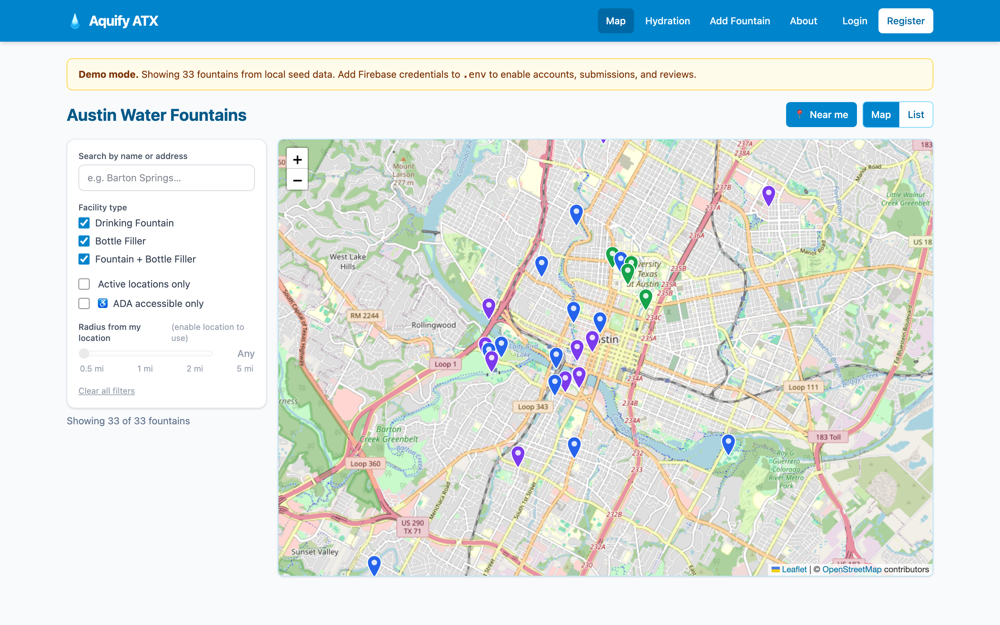
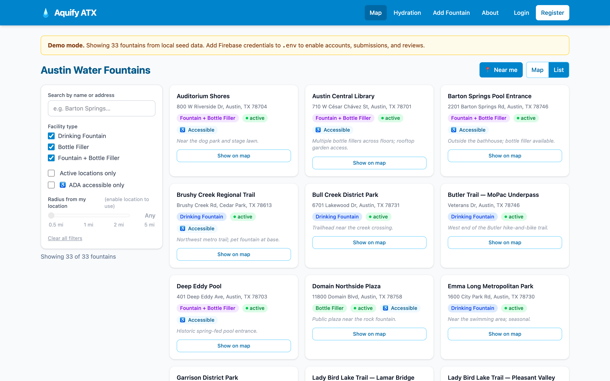
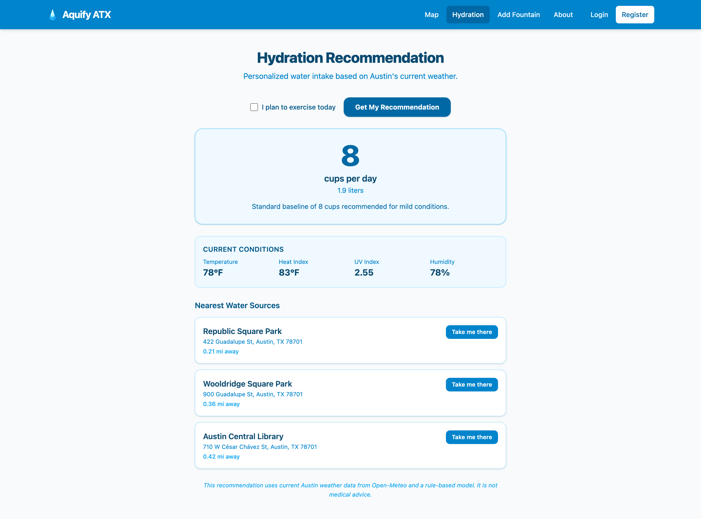
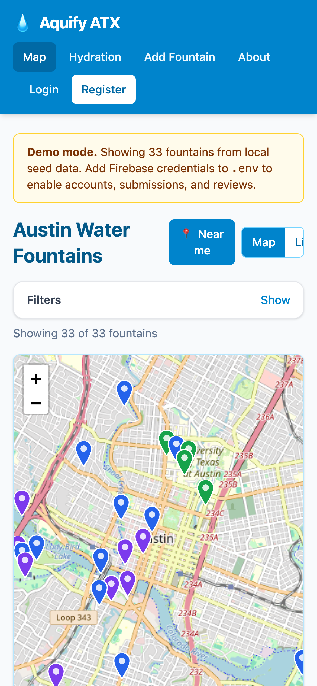
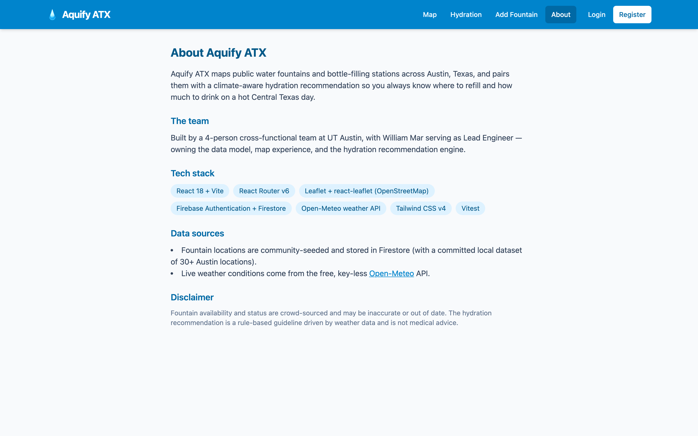

# Aquify ATX 💧

> Find every public water fountain in Austin — and get a personalized hydration recommendation powered by live Central Texas weather. **Live now.**

[](https://github.com/billdmar/aquify-atx/actions/workflows/ci.yml)
[](LICENSE)
[](https://react.dev)
[](https://vitejs.dev)
[](https://firebase.google.com)
[](https://tailwindcss.com)
[](https://leafletjs.com)
[](https://aquify-atx.vercel.app)

**🔗 Live Demo:** [aquify-atx.vercel.app](https://aquify-atx.vercel.app)

---



---

## ✨ Features

- **Interactive map** — Leaflet + OpenStreetMap, 30+ real Austin fountain locations, color-coded by type, with detail popups.
- **Filters + Near Me** — filter by type, ADA accessibility, active status, free-text search, and distance radius; one-tap geolocation.
- **Firebase Auth** — email/password and Google sign-in, protected routes, per-user profile.
- **Community submissions & reviews** — authenticated users can submit new fountains and leave star-rated reviews; Firestore security rules enforce owner-only edits.
- **Climate-driven hydration engine** — rule-based model (`src/recommend/hydroEngine.js`) pulls live Open-Meteo weather data (temp, heat index, UV, humidity) and recommends daily water intake plus the 3 nearest open fountains.
- **Responsive** — fluid layout works from 390 px mobile up to wide desktop.
- **Demo mode** — runs fully offline on committed seed data; no Firebase config required to explore the map, filters, and hydration engine.

---

## 📸 Screenshots

<table>
<tr>
<td align="center" width="50%">

**Filterable fountain list**



</td>
<td align="center" width="50%">

**Live hydration recommendation**



</td>
</tr>
</table>

<p align="center">
  
  <br/>
  <em>390 px mobile — same full feature set</em>
</p>



---

## 🛠 Tech Stack

| Layer | Choice |
|-------|--------|
| Frontend | React 18 + Vite, React Router v6, JavaScript |
| Styling | Tailwind CSS v4 |
| Map | Leaflet + react-leaflet (OpenStreetMap tiles — no API key) |
| Auth / DB | Firebase Authentication + Cloud Firestore (v9 modular SDK) |
| Weather | Open-Meteo API (free, key-less) |
| Tests | Vitest + React Testing Library · **150 passing tests** |
| CI | GitHub Actions — lint + build + test on every push |
| Hosting | Firebase Hosting / Vercel |

---

## 🚀 Quickstart

```bash
git clone https://github.com/billdmar/aquify-atx.git
cd aquify-atx
npm install
npm run dev        # demo mode — no Firebase needed
```

Open [http://localhost:5173](http://localhost:5173). The map, filters, and hydration engine all work immediately on local seed data.

<details>
<summary><strong>Full Firebase setup (auth, live Firestore, community features)</strong></summary>

1. Create a Firebase project; enable **Authentication** (Email/Password + Google) and **Firestore**.
2. Copy the config into a local env file:
   ```bash
   cp .env.example .env
   # Fill in VITE_FIREBASE_* values from your Firebase project settings
   ```
3. Seed fountain data (requires a service-account key):
   ```bash
   GOOGLE_APPLICATION_CREDENTIALS=./serviceAccountKey.json npm run seed
   ```
4. Deploy Firestore security rules:
   ```bash
   firebase deploy --only firestore:rules
   ```

`.env` and all `*serviceAccount*.json` files are gitignored — **no secrets are ever committed.**

</details>

### Scripts

| Command | Description |
|---------|-------------|
| `npm run dev` | Start Vite dev server |
| `npm run build` | Production build → `dist/` |
| `npm run preview` | Preview production build |
| `npm run lint` | ESLint (zero warnings in CI) |
| `npm test` | Vitest watch mode |
| `npm run test:run` | Vitest single run (used in CI) |
| `npm run seed` | Seed Firestore from `src/data/fountains.json` |

---

## 💧 Hydration Recommendation Model

A transparent, rule-based engine in `src/recommend/hydroEngine.js` — not a black box. Live conditions come from Open-Meteo for downtown Austin; the engine falls back to documented warm-season averages when the API is unavailable.

| Condition | Adjustment |
|-----------|-----------|
| Baseline | 8 cups (≈ 1.9 L) / day |
| Temperature > 90 °F | + 1 cup |
| Heat index > 100 °F | + 1 cup |
| UV index ≥ 6 | + 1 cup |
| Humidity < 30 % | + 0.5 cup |
| Planning to exercise | + 1 cup |

The recommendation surfaces the specific weather factors that raised it and names the 3 nearest open fountains with walking distances. **This is not medical advice.**

---

## 🏗 Architecture & Project Structure

```
aquify-atx/
├── src/
│   ├── components/   Map, FountainList, FountainCard, FilterBar,
│   │                 ReviewModal, NavBar, PrivateRoute
│   ├── context/      AuthContext, FountainContext
│   ├── lib/          firebase, auth, firestore, geo (Haversine distance)
│   ├── pages/        Home, Login, Register, Profile, Submit, Recommend, About
│   ├── recommend/    hydroEngine.js + hydroEngine.test.js
│   └── data/         fountains.json (30+ Austin locations, seed source)
├── scripts/seed.js   Firestore seeder (Admin SDK)
├── firestore.rules   committed security rules
└── .github/workflows/ci.yml
```

**Testing:** 150 passing Vitest + React Testing Library tests covering the hydration engine, Firestore helpers, component rendering, and filter logic. ESLint clean. GitHub Actions runs lint → build → test on every push.

**Separation of concerns:** UI components are stateless and receive data via React Context; all Firebase and weather I/O is isolated in `src/lib/` and `src/recommend/`, making the core map and filter experience fully testable without mocking an entire backend.

---

## 🔒 Firestore Data Model & Security

```
/fountains/{id}     public read; writes only via Admin SDK seed script
/submissions/{id}   public read; create if authenticated; update/delete by owner only
/reviews/{id}       public read; create if authenticated; update/delete by owner only
/users/{uid}        read/write by that user only
```

Rules live in `firestore.rules` and are committed verbatim — the security model is auditable in the repo, not locked away in the Firebase console.

---

## 🌐 Deployment

**Vercel (recommended for demos):**
```bash
npm run build
# push to GitHub and connect repo in Vercel dashboard — zero config needed
```

**Firebase Hosting:**
```bash
npm run build
firebase deploy        # serves dist/ via Firebase CDN
```

SPA rewrite to `index.html` is already configured in `firebase.json`.

---

## License

MIT © 2026 William Mar
